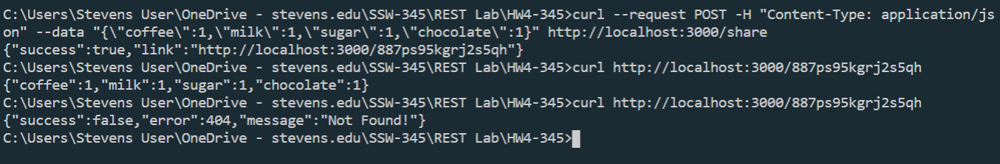

# Answers
I successfully edited the code so that it completes the tasks required. Here are my edited files [index.js](index.js) and [test.js](test/test.js) files.

The second part was difficult because the the commands you gave us were in the Mac syntax. For example you gave us `curl --request POST -H "Content-Type: application/json" --data '{"coffee":1,"milk":1,"sugar":1,"chocolate":1}' http://localhost:3000/share`
but for Windows it should be `curl --request POST -H "Content-Type: application/json" --data "{\"coffee\":1,\"milk\":1,\"sugar\":1,\"chocolate\":1}" http://localhost:3000/share`
### Successful Test Results

### Successful REST Server Interaction

