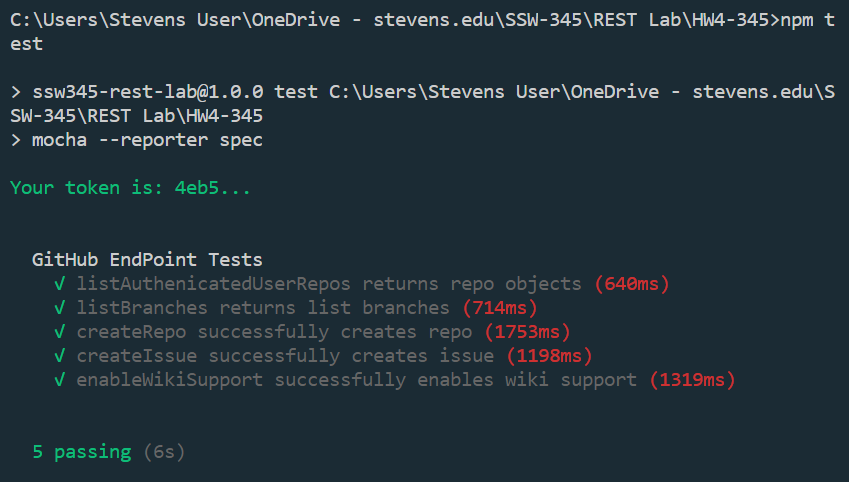

# Answers
My edited [index.js](index.js) [test.js](test/test.js)
curl --request POST -H "Content-Type: application/json" --data '{"coffee":1,"milk":1,"sugar":1,"chocolate":1}' http://localhost:3000/share
curl --request POST -H "Content-Type: application/json" --data "{\"coffee\":1,\"milk\":1,\"sugar\":1,\"chocolate\":1}" http://localhost:3000/share
### Successful Test Results

